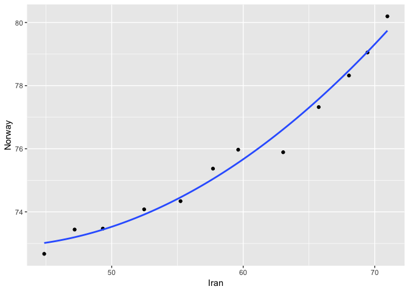

Assignment 4
================

``` r
library(gapminder)
library(tidyverse)
```

    ## -- Attaching packages -------------------------------------------------------- tidyverse 1.2.1 --

    ## <U+221A> ggplot2 3.0.0     <U+221A> purrr   0.2.4
    ## <U+221A> tibble  1.4.2     <U+221A> dplyr   0.7.6
    ## <U+221A> tidyr   0.8.1     <U+221A> stringr 1.2.0
    ## <U+221A> readr   1.1.1     <U+221A> forcats 0.3.0

    ## Warning: package 'ggplot2' was built under R version 3.4.4

    ## Warning: package 'tidyr' was built under R version 3.4.4

    ## Warning: package 'dplyr' was built under R version 3.4.4

    ## -- Conflicts ----------------------------------------------------------- tidyverse_conflicts() --
    ## x dplyr::filter() masks stats::filter()
    ## x dplyr::lag()    masks stats::lag()

``` r
library(dplyr)
library(ggplot2)
```

***Task 1 - Activity 2***

For this task I will choose four countries and make a tibble with one row per year and columns for life expectancy. The data set I will use is `gapminder`, and the four countries I will look further into are `Norway`, `Canada`, `Zimbabwe` and `Iran`.

First: Prepare the data set:

``` r
library(gapminder)


lexp = gapminder %>% 
  filter(country %in% c('Norway', 'Canada', 'Iran', 'Zimbabwe')) %>% 
           select(country, year, lifeExp)
```

    ## Warning: package 'bindrcpp' was built under R version 3.4.4

When the data set is prepared, the table can be made by first reshaping the data so that the correct data is displayed where it is supposed to:

``` r
lexp_spread = lexp %>% 
  spread(country, lifeExp)
```

Now we can create the table:

``` r
lexp_spread %>% 
  knitr::kable()
```

|  year|  Canada|    Iran|  Norway|  Zimbabwe|
|-----:|-------:|-------:|-------:|---------:|
|  1952|  68.750|  44.869|  72.670|    48.451|
|  1957|  69.960|  47.181|  73.440|    50.469|
|  1962|  71.300|  49.325|  73.470|    52.358|
|  1967|  72.130|  52.469|  74.080|    53.995|
|  1972|  72.880|  55.234|  74.340|    55.635|
|  1977|  74.210|  57.702|  75.370|    57.674|
|  1982|  75.760|  59.620|  75.970|    60.363|
|  1987|  76.860|  63.040|  75.890|    62.351|
|  1992|  77.950|  65.742|  77.320|    60.377|
|  1997|  78.610|  68.042|  78.320|    46.809|
|  2002|  79.770|  69.451|  79.050|    39.989|
|  2007|  80.653|  70.964|  80.196|    43.487|

This data can be used to generate a scatterplot of the life expectancy of `Iran` versus the one of `Norway`:

``` r
lexp_spread %>% 
  ggplot(aes(Iran, Norway)) + 
  geom_point() + 
  stat_smooth(method = 'gam', formula = y ~poly(x,2), se = FALSE)
```

 There is also added a second degree ploynomial line to indicate the trend of the points. It is interesting to see that Iran has increased its life expectancy in a much higher rate than Norway has over the same time span.

***Task 2 - Activity \#1***

Parts of the `gapminder` data set could be linked to some other data set, for instance we could look further into the countries and their respective life- cycle savings hypothesis using the built-in data set `LifeCycleSavings`.

``` r
df = LifeCycleSavings

#Excerpt of the data set
knitr::kable(head(df,10))
```

|            |     sr|  pop15|  pop75|      dpi|  ddpi|
|------------|------:|------:|------:|--------:|-----:|
| Australia  |  11.43|  29.35|   2.87|  2329.68|  2.87|
| Austria    |  12.07|  23.32|   4.41|  1507.99|  3.93|
| Belgium    |  13.17|  23.80|   4.43|  2108.47|  3.82|
| Bolivia    |   5.75|  41.89|   1.67|   189.13|  0.22|
| Brazil     |  12.88|  42.19|   0.83|   728.47|  4.56|
| Canada     |   8.79|  31.72|   2.85|  2982.88|  2.43|
| Chile      |   0.60|  39.74|   1.34|   662.86|  2.67|
| China      |  11.90|  44.75|   0.67|   289.52|  6.51|
| Colombia   |   4.98|  46.64|   1.06|   276.65|  3.08|
| Costa Rica |  10.78|  47.64|   1.14|   471.24|  2.80|

Let us look further into the percent of the per-capita disposable income (dpi) and the percentage of growth rate of dpi (ddpi).

``` r
new_df = LifeCycleSavings %>% 
  select(dpi, ddpi) %>% 
  rownames_to_column("country")

head(new_df,10)
```

    ##       country     dpi ddpi
    ## 1   Australia 2329.68 2.87
    ## 2     Austria 1507.99 3.93
    ## 3     Belgium 2108.47 3.82
    ## 4     Bolivia  189.13 0.22
    ## 5      Brazil  728.47 4.56
    ## 6      Canada 2982.88 2.43
    ## 7       Chile  662.86 2.67
    ## 8       China  289.52 6.51
    ## 9    Colombia  276.65 3.08
    ## 10 Costa Rica  471.24 2.80

Let us now join the two datasets using both `right_join` and `left_join`. The two sets are of different dimensions, with gapminder having 4 columns and 142 rows whilst our new data set `new_df` has 3 columns and 50 rows.

*Right\_join:*

``` r
rightj_ex =gapminder %>% 
  select(country, continent, year, gdpPercap) %>% 
  
  right_join(new_df,by=c("country"))
```

    ## Warning: Column `country` joining factor and character vector, coercing
    ## into character vector

``` r
#filter by fixed year and display

rightj_ex %>% 
  filter(year == 1977) %>% 
  knitr::kable()
```

| country        | continent |  year|   gdpPercap|      dpi|   ddpi|
|:---------------|:----------|-----:|-----------:|--------:|------:|
| Australia      | Oceania   |  1977|  18334.1975|  2329.68|   2.87|
| Austria        | Europe    |  1977|  19749.4223|  1507.99|   3.93|
| Belgium        | Europe    |  1977|  19117.9745|  2108.47|   3.82|
| Bolivia        | Americas  |  1977|   3548.0978|   189.13|   0.22|
| Brazil         | Americas  |  1977|   6660.1187|   728.47|   4.56|
| Canada         | Americas  |  1977|  22090.8831|  2982.88|   2.43|
| Chile          | Americas  |  1977|   4756.7638|   662.86|   2.67|
| China          | Asia      |  1977|    741.2375|   289.52|   6.51|
| Colombia       | Americas  |  1977|   3815.8079|   276.65|   3.08|
| Costa Rica     | Americas  |  1977|   5926.8770|   471.24|   2.80|
| Denmark        | Europe    |  1977|  20422.9015|  2496.53|   3.99|
| Ecuador        | Americas  |  1977|   6679.6233|   287.77|   2.19|
| Finland        | Europe    |  1977|  15605.4228|  1681.25|   4.32|
| France         | Europe    |  1977|  18292.6351|  2213.82|   4.52|
| Germany        | Europe    |  1977|  20512.9212|  2457.12|   3.44|
| Greece         | Europe    |  1977|  14195.5243|   870.85|   6.28|
| Honduras       | Americas  |  1977|   3203.2081|   232.44|   3.19|
| Iceland        | Europe    |  1977|  19654.9625|  1900.10|   1.12|
| India          | Asia      |  1977|    813.3373|    88.94|   1.54|
| Ireland        | Europe    |  1977|  11150.9811|  1139.95|   2.99|
| Italy          | Europe    |  1977|  14255.9847|  1390.00|   3.54|
| Japan          | Asia      |  1977|  16610.3770|  1257.28|   8.21|
| Norway         | Europe    |  1977|  23311.3494|  2231.03|   3.62|
| Netherlands    | Europe    |  1977|  21209.0592|  1740.70|   7.66|
| New Zealand    | Oceania   |  1977|  16233.7177|  1487.52|   1.76|
| Nicaragua      | Americas  |  1977|   5486.3711|   325.54|   2.48|
| Panama         | Americas  |  1977|   5351.9121|   568.56|   3.61|
| Paraguay       | Americas  |  1977|   3248.3733|   220.56|   1.03|
| Peru           | Americas  |  1977|   6281.2909|   400.06|   0.67|
| Philippines    | Asia      |  1977|   2373.2043|   152.01|   2.00|
| Portugal       | Europe    |  1977|  10172.4857|   579.51|   7.48|
| South Africa   | Africa    |  1977|   8028.6514|   651.11|   2.19|
| Spain          | Europe    |  1977|  13236.9212|   768.79|   4.35|
| Sweden         | Europe    |  1977|  18855.7252|  3299.49|   3.01|
| Switzerland    | Europe    |  1977|  26982.2905|  2630.96|   2.70|
| Turkey         | Europe    |  1977|   4269.1223|   389.66|   2.96|
| Tunisia        | Africa    |  1977|   3120.8768|   249.87|   1.13|
| United Kingdom | Europe    |  1977|  17428.7485|  1813.93|   2.01|
| United States  | Americas  |  1977|  24072.6321|  4001.89|   2.45|
| Venezuela      | Americas  |  1977|  13143.9510|   813.39|   0.53|
| Zambia         | Africa    |  1977|   1588.6883|   138.33|   5.14|
| Jamaica        | Americas  |  1977|   6650.1956|   380.47|  10.23|
| Uruguay        | Americas  |  1977|   6504.3397|   766.54|   1.88|
| Libya          | Africa    |  1977|  21951.2118|   123.58|  16.71|
| Malaysia       | Asia      |  1977|   3827.9216|   242.69|   5.08|

Let us try the same using `left_join`:

*Left\_join:*

``` r
leftj_ex =gapminder %>% 
  select(country, continent, year, gdpPercap) %>% 
  
  left_join(new_df,by=c("country"))
```

    ## Warning: Column `country` joining factor and character vector, coercing
    ## into character vector

``` r
#filter by fixed year and display

leftj_ex %>% 
  filter(year == 1977) %>% 
  knitr::kable()
```

| country                  | continent |  year|   gdpPercap|      dpi|   ddpi|
|:-------------------------|:----------|-----:|-----------:|--------:|------:|
| Afghanistan              | Asia      |  1977|    786.1134|       NA|     NA|
| Albania                  | Europe    |  1977|   3533.0039|       NA|     NA|
| Algeria                  | Africa    |  1977|   4910.4168|       NA|     NA|
| Angola                   | Africa    |  1977|   3008.6474|       NA|     NA|
| Argentina                | Americas  |  1977|  10079.0267|       NA|     NA|
| Australia                | Oceania   |  1977|  18334.1975|  2329.68|   2.87|
| Austria                  | Europe    |  1977|  19749.4223|  1507.99|   3.93|
| Bahrain                  | Asia      |  1977|  19340.1020|       NA|     NA|
| Bangladesh               | Asia      |  1977|    659.8772|       NA|     NA|
| Belgium                  | Europe    |  1977|  19117.9745|  2108.47|   3.82|
| Benin                    | Africa    |  1977|   1029.1613|       NA|     NA|
| Bolivia                  | Americas  |  1977|   3548.0978|   189.13|   0.22|
| Bosnia and Herzegovina   | Europe    |  1977|   3528.4813|       NA|     NA|
| Botswana                 | Africa    |  1977|   3214.8578|       NA|     NA|
| Brazil                   | Americas  |  1977|   6660.1187|   728.47|   4.56|
| Bulgaria                 | Europe    |  1977|   7612.2404|       NA|     NA|
| Burkina Faso             | Africa    |  1977|    743.3870|       NA|     NA|
| Burundi                  | Africa    |  1977|    556.1033|       NA|     NA|
| Cambodia                 | Asia      |  1977|    524.9722|       NA|     NA|
| Cameroon                 | Africa    |  1977|   1783.4329|       NA|     NA|
| Canada                   | Americas  |  1977|  22090.8831|  2982.88|   2.43|
| Central African Republic | Africa    |  1977|   1109.3743|       NA|     NA|
| Chad                     | Africa    |  1977|   1133.9850|       NA|     NA|
| Chile                    | Americas  |  1977|   4756.7638|   662.86|   2.67|
| China                    | Asia      |  1977|    741.2375|   289.52|   6.51|
| Colombia                 | Americas  |  1977|   3815.8079|   276.65|   3.08|
| Comoros                  | Africa    |  1977|   1172.6030|       NA|     NA|
| Congo, Dem. Rep.         | Africa    |  1977|    795.7573|       NA|     NA|
| Congo, Rep.              | Africa    |  1977|   3259.1790|       NA|     NA|
| Costa Rica               | Americas  |  1977|   5926.8770|   471.24|   2.80|
| Cote d'Ivoire            | Africa    |  1977|   2517.7365|       NA|     NA|
| Croatia                  | Europe    |  1977|  11305.3852|       NA|     NA|
| Cuba                     | Americas  |  1977|   6380.4950|       NA|     NA|
| Czech Republic           | Europe    |  1977|  14800.1606|       NA|     NA|
| Denmark                  | Europe    |  1977|  20422.9015|  2496.53|   3.99|
| Djibouti                 | Africa    |  1977|   3081.7610|       NA|     NA|
| Dominican Republic       | Americas  |  1977|   2681.9889|       NA|     NA|
| Ecuador                  | Americas  |  1977|   6679.6233|   287.77|   2.19|
| Egypt                    | Africa    |  1977|   2785.4936|       NA|     NA|
| El Salvador              | Americas  |  1977|   5138.9224|       NA|     NA|
| Equatorial Guinea        | Africa    |  1977|    958.5668|       NA|     NA|
| Eritrea                  | Africa    |  1977|    505.7538|       NA|     NA|
| Ethiopia                 | Africa    |  1977|    556.8084|       NA|     NA|
| Finland                  | Europe    |  1977|  15605.4228|  1681.25|   4.32|
| France                   | Europe    |  1977|  18292.6351|  2213.82|   4.52|
| Gabon                    | Africa    |  1977|  21745.5733|       NA|     NA|
| Gambia                   | Africa    |  1977|    884.7553|       NA|     NA|
| Germany                  | Europe    |  1977|  20512.9212|  2457.12|   3.44|
| Ghana                    | Africa    |  1977|    993.2240|       NA|     NA|
| Greece                   | Europe    |  1977|  14195.5243|   870.85|   6.28|
| Guatemala                | Americas  |  1977|   4879.9927|       NA|     NA|
| Guinea                   | Africa    |  1977|    874.6859|       NA|     NA|
| Guinea-Bissau            | Africa    |  1977|    764.7260|       NA|     NA|
| Haiti                    | Americas  |  1977|   1874.2989|       NA|     NA|
| Honduras                 | Americas  |  1977|   3203.2081|   232.44|   3.19|
| Hong Kong, China         | Asia      |  1977|  11186.1413|       NA|     NA|
| Hungary                  | Europe    |  1977|  11674.8374|       NA|     NA|
| Iceland                  | Europe    |  1977|  19654.9625|  1900.10|   1.12|
| India                    | Asia      |  1977|    813.3373|    88.94|   1.54|
| Indonesia                | Asia      |  1977|   1382.7021|       NA|     NA|
| Iran                     | Asia      |  1977|  11888.5951|       NA|     NA|
| Iraq                     | Asia      |  1977|  14688.2351|       NA|     NA|
| Ireland                  | Europe    |  1977|  11150.9811|  1139.95|   2.99|
| Israel                   | Asia      |  1977|  13306.6192|       NA|     NA|
| Italy                    | Europe    |  1977|  14255.9847|  1390.00|   3.54|
| Jamaica                  | Americas  |  1977|   6650.1956|   380.47|  10.23|
| Japan                    | Asia      |  1977|  16610.3770|  1257.28|   8.21|
| Jordan                   | Asia      |  1977|   2852.3516|       NA|     NA|
| Kenya                    | Africa    |  1977|   1267.6132|       NA|     NA|
| Korea, Dem. Rep.         | Asia      |  1977|   4106.3012|       NA|     NA|
| Korea, Rep.              | Asia      |  1977|   4657.2210|       NA|     NA|
| Kuwait                   | Asia      |  1977|  59265.4771|       NA|     NA|
| Lebanon                  | Asia      |  1977|   8659.6968|       NA|     NA|
| Lesotho                  | Africa    |  1977|    745.3695|       NA|     NA|
| Liberia                  | Africa    |  1977|    640.3224|       NA|     NA|
| Libya                    | Africa    |  1977|  21951.2118|   123.58|  16.71|
| Madagascar               | Africa    |  1977|   1544.2286|       NA|     NA|
| Malawi                   | Africa    |  1977|    663.2237|       NA|     NA|
| Malaysia                 | Asia      |  1977|   3827.9216|   242.69|   5.08|
| Mali                     | Africa    |  1977|    686.3953|       NA|     NA|
| Mauritania               | Africa    |  1977|   1497.4922|       NA|     NA|
| Mauritius                | Africa    |  1977|   3710.9830|       NA|     NA|
| Mexico                   | Americas  |  1977|   7674.9291|       NA|     NA|
| Mongolia                 | Asia      |  1977|   1647.5117|       NA|     NA|
| Montenegro               | Europe    |  1977|   9595.9299|       NA|     NA|
| Morocco                  | Africa    |  1977|   2370.6200|       NA|     NA|
| Mozambique               | Africa    |  1977|    502.3197|       NA|     NA|
| Myanmar                  | Asia      |  1977|    371.0000|       NA|     NA|
| Namibia                  | Africa    |  1977|   3876.4860|       NA|     NA|
| Nepal                    | Asia      |  1977|    694.1124|       NA|     NA|
| Netherlands              | Europe    |  1977|  21209.0592|  1740.70|   7.66|
| New Zealand              | Oceania   |  1977|  16233.7177|  1487.52|   1.76|
| Nicaragua                | Americas  |  1977|   5486.3711|   325.54|   2.48|
| Niger                    | Africa    |  1977|    808.8971|       NA|     NA|
| Nigeria                  | Africa    |  1977|   1981.9518|       NA|     NA|
| Norway                   | Europe    |  1977|  23311.3494|  2231.03|   3.62|
| Oman                     | Asia      |  1977|  11848.3439|       NA|     NA|
| Pakistan                 | Asia      |  1977|   1175.9212|       NA|     NA|
| Panama                   | Americas  |  1977|   5351.9121|   568.56|   3.61|
| Paraguay                 | Americas  |  1977|   3248.3733|   220.56|   1.03|
| Peru                     | Americas  |  1977|   6281.2909|   400.06|   0.67|
| Philippines              | Asia      |  1977|   2373.2043|   152.01|   2.00|
| Poland                   | Europe    |  1977|   9508.1415|       NA|     NA|
| Portugal                 | Europe    |  1977|  10172.4857|   579.51|   7.48|
| Puerto Rico              | Americas  |  1977|   9770.5249|       NA|     NA|
| Reunion                  | Africa    |  1977|   4319.8041|       NA|     NA|
| Romania                  | Europe    |  1977|   9356.3972|       NA|     NA|
| Rwanda                   | Africa    |  1977|    670.0806|       NA|     NA|
| Sao Tome and Principe    | Africa    |  1977|   1737.5617|       NA|     NA|
| Saudi Arabia             | Asia      |  1977|  34167.7626|       NA|     NA|
| Senegal                  | Africa    |  1977|   1561.7691|       NA|     NA|
| Serbia                   | Europe    |  1977|  12980.6696|       NA|     NA|
| Sierra Leone             | Africa    |  1977|   1348.2852|       NA|     NA|
| Singapore                | Asia      |  1977|  11210.0895|       NA|     NA|
| Slovak Republic          | Europe    |  1977|  10922.6640|       NA|     NA|
| Slovenia                 | Europe    |  1977|  15277.0302|       NA|     NA|
| Somalia                  | Africa    |  1977|   1450.9925|       NA|     NA|
| South Africa             | Africa    |  1977|   8028.6514|   651.11|   2.19|
| Spain                    | Europe    |  1977|  13236.9212|   768.79|   4.35|
| Sri Lanka                | Asia      |  1977|   1348.7757|       NA|     NA|
| Sudan                    | Africa    |  1977|   2202.9884|       NA|     NA|
| Swaziland                | Africa    |  1977|   3781.4106|       NA|     NA|
| Sweden                   | Europe    |  1977|  18855.7252|  3299.49|   3.01|
| Switzerland              | Europe    |  1977|  26982.2905|  2630.96|   2.70|
| Syria                    | Asia      |  1977|   3195.4846|       NA|     NA|
| Taiwan                   | Asia      |  1977|   5596.5198|       NA|     NA|
| Tanzania                 | Africa    |  1977|    962.4923|       NA|     NA|
| Thailand                 | Asia      |  1977|   1961.2246|       NA|     NA|
| Togo                     | Africa    |  1977|   1532.7770|       NA|     NA|
| Trinidad and Tobago      | Americas  |  1977|   7899.5542|       NA|     NA|
| Tunisia                  | Africa    |  1977|   3120.8768|   249.87|   1.13|
| Turkey                   | Europe    |  1977|   4269.1223|   389.66|   2.96|
| Uganda                   | Africa    |  1977|    843.7331|       NA|     NA|
| United Kingdom           | Europe    |  1977|  17428.7485|  1813.93|   2.01|
| United States            | Americas  |  1977|  24072.6321|  4001.89|   2.45|
| Uruguay                  | Americas  |  1977|   6504.3397|   766.54|   1.88|
| Venezuela                | Americas  |  1977|  13143.9510|   813.39|   0.53|
| Vietnam                  | Asia      |  1977|    713.5371|       NA|     NA|
| West Bank and Gaza       | Asia      |  1977|   3682.8315|       NA|     NA|
| Yemen, Rep.              | Asia      |  1977|   1829.7652|       NA|     NA|
| Zambia                   | Africa    |  1977|   1588.6883|   138.33|   5.14|
| Zimbabwe                 | Africa    |  1977|    685.5877|       NA|     NA|

We observe that left\_join and right\_join returns some rows with missing values. This is because the respective functions returns all the rows from one of the data sets so that in this case, right\_join would return 50 rows fitted to the `new_df` and left\_join fits the `gapminder` set: right\_join(x,y) would for instance return all rows from y, and the opposite would happen with left\_join(x,y). This results in the displayed data loss.

If we want all rows to be displayed, we could use `full_join`:

``` r
fullj_ex =gapminder %>% 
  select(country, continent, year, gdpPercap) %>% 
  
  full_join(new_df,by=c("country"))
```

    ## Warning: Column `country` joining factor and character vector, coercing
    ## into character vector

``` r
#filter by fixed year and display


fullj_ex %>% 
  filter(year == 1977) %>% 
  knitr::kable()
```

| country                  | continent |  year|   gdpPercap|      dpi|   ddpi|
|:-------------------------|:----------|-----:|-----------:|--------:|------:|
| Afghanistan              | Asia      |  1977|    786.1134|       NA|     NA|
| Albania                  | Europe    |  1977|   3533.0039|       NA|     NA|
| Algeria                  | Africa    |  1977|   4910.4168|       NA|     NA|
| Angola                   | Africa    |  1977|   3008.6474|       NA|     NA|
| Argentina                | Americas  |  1977|  10079.0267|       NA|     NA|
| Australia                | Oceania   |  1977|  18334.1975|  2329.68|   2.87|
| Austria                  | Europe    |  1977|  19749.4223|  1507.99|   3.93|
| Bahrain                  | Asia      |  1977|  19340.1020|       NA|     NA|
| Bangladesh               | Asia      |  1977|    659.8772|       NA|     NA|
| Belgium                  | Europe    |  1977|  19117.9745|  2108.47|   3.82|
| Benin                    | Africa    |  1977|   1029.1613|       NA|     NA|
| Bolivia                  | Americas  |  1977|   3548.0978|   189.13|   0.22|
| Bosnia and Herzegovina   | Europe    |  1977|   3528.4813|       NA|     NA|
| Botswana                 | Africa    |  1977|   3214.8578|       NA|     NA|
| Brazil                   | Americas  |  1977|   6660.1187|   728.47|   4.56|
| Bulgaria                 | Europe    |  1977|   7612.2404|       NA|     NA|
| Burkina Faso             | Africa    |  1977|    743.3870|       NA|     NA|
| Burundi                  | Africa    |  1977|    556.1033|       NA|     NA|
| Cambodia                 | Asia      |  1977|    524.9722|       NA|     NA|
| Cameroon                 | Africa    |  1977|   1783.4329|       NA|     NA|
| Canada                   | Americas  |  1977|  22090.8831|  2982.88|   2.43|
| Central African Republic | Africa    |  1977|   1109.3743|       NA|     NA|
| Chad                     | Africa    |  1977|   1133.9850|       NA|     NA|
| Chile                    | Americas  |  1977|   4756.7638|   662.86|   2.67|
| China                    | Asia      |  1977|    741.2375|   289.52|   6.51|
| Colombia                 | Americas  |  1977|   3815.8079|   276.65|   3.08|
| Comoros                  | Africa    |  1977|   1172.6030|       NA|     NA|
| Congo, Dem. Rep.         | Africa    |  1977|    795.7573|       NA|     NA|
| Congo, Rep.              | Africa    |  1977|   3259.1790|       NA|     NA|
| Costa Rica               | Americas  |  1977|   5926.8770|   471.24|   2.80|
| Cote d'Ivoire            | Africa    |  1977|   2517.7365|       NA|     NA|
| Croatia                  | Europe    |  1977|  11305.3852|       NA|     NA|
| Cuba                     | Americas  |  1977|   6380.4950|       NA|     NA|
| Czech Republic           | Europe    |  1977|  14800.1606|       NA|     NA|
| Denmark                  | Europe    |  1977|  20422.9015|  2496.53|   3.99|
| Djibouti                 | Africa    |  1977|   3081.7610|       NA|     NA|
| Dominican Republic       | Americas  |  1977|   2681.9889|       NA|     NA|
| Ecuador                  | Americas  |  1977|   6679.6233|   287.77|   2.19|
| Egypt                    | Africa    |  1977|   2785.4936|       NA|     NA|
| El Salvador              | Americas  |  1977|   5138.9224|       NA|     NA|
| Equatorial Guinea        | Africa    |  1977|    958.5668|       NA|     NA|
| Eritrea                  | Africa    |  1977|    505.7538|       NA|     NA|
| Ethiopia                 | Africa    |  1977|    556.8084|       NA|     NA|
| Finland                  | Europe    |  1977|  15605.4228|  1681.25|   4.32|
| France                   | Europe    |  1977|  18292.6351|  2213.82|   4.52|
| Gabon                    | Africa    |  1977|  21745.5733|       NA|     NA|
| Gambia                   | Africa    |  1977|    884.7553|       NA|     NA|
| Germany                  | Europe    |  1977|  20512.9212|  2457.12|   3.44|
| Ghana                    | Africa    |  1977|    993.2240|       NA|     NA|
| Greece                   | Europe    |  1977|  14195.5243|   870.85|   6.28|
| Guatemala                | Americas  |  1977|   4879.9927|       NA|     NA|
| Guinea                   | Africa    |  1977|    874.6859|       NA|     NA|
| Guinea-Bissau            | Africa    |  1977|    764.7260|       NA|     NA|
| Haiti                    | Americas  |  1977|   1874.2989|       NA|     NA|
| Honduras                 | Americas  |  1977|   3203.2081|   232.44|   3.19|
| Hong Kong, China         | Asia      |  1977|  11186.1413|       NA|     NA|
| Hungary                  | Europe    |  1977|  11674.8374|       NA|     NA|
| Iceland                  | Europe    |  1977|  19654.9625|  1900.10|   1.12|
| India                    | Asia      |  1977|    813.3373|    88.94|   1.54|
| Indonesia                | Asia      |  1977|   1382.7021|       NA|     NA|
| Iran                     | Asia      |  1977|  11888.5951|       NA|     NA|
| Iraq                     | Asia      |  1977|  14688.2351|       NA|     NA|
| Ireland                  | Europe    |  1977|  11150.9811|  1139.95|   2.99|
| Israel                   | Asia      |  1977|  13306.6192|       NA|     NA|
| Italy                    | Europe    |  1977|  14255.9847|  1390.00|   3.54|
| Jamaica                  | Americas  |  1977|   6650.1956|   380.47|  10.23|
| Japan                    | Asia      |  1977|  16610.3770|  1257.28|   8.21|
| Jordan                   | Asia      |  1977|   2852.3516|       NA|     NA|
| Kenya                    | Africa    |  1977|   1267.6132|       NA|     NA|
| Korea, Dem. Rep.         | Asia      |  1977|   4106.3012|       NA|     NA|
| Korea, Rep.              | Asia      |  1977|   4657.2210|       NA|     NA|
| Kuwait                   | Asia      |  1977|  59265.4771|       NA|     NA|
| Lebanon                  | Asia      |  1977|   8659.6968|       NA|     NA|
| Lesotho                  | Africa    |  1977|    745.3695|       NA|     NA|
| Liberia                  | Africa    |  1977|    640.3224|       NA|     NA|
| Libya                    | Africa    |  1977|  21951.2118|   123.58|  16.71|
| Madagascar               | Africa    |  1977|   1544.2286|       NA|     NA|
| Malawi                   | Africa    |  1977|    663.2237|       NA|     NA|
| Malaysia                 | Asia      |  1977|   3827.9216|   242.69|   5.08|
| Mali                     | Africa    |  1977|    686.3953|       NA|     NA|
| Mauritania               | Africa    |  1977|   1497.4922|       NA|     NA|
| Mauritius                | Africa    |  1977|   3710.9830|       NA|     NA|
| Mexico                   | Americas  |  1977|   7674.9291|       NA|     NA|
| Mongolia                 | Asia      |  1977|   1647.5117|       NA|     NA|
| Montenegro               | Europe    |  1977|   9595.9299|       NA|     NA|
| Morocco                  | Africa    |  1977|   2370.6200|       NA|     NA|
| Mozambique               | Africa    |  1977|    502.3197|       NA|     NA|
| Myanmar                  | Asia      |  1977|    371.0000|       NA|     NA|
| Namibia                  | Africa    |  1977|   3876.4860|       NA|     NA|
| Nepal                    | Asia      |  1977|    694.1124|       NA|     NA|
| Netherlands              | Europe    |  1977|  21209.0592|  1740.70|   7.66|
| New Zealand              | Oceania   |  1977|  16233.7177|  1487.52|   1.76|
| Nicaragua                | Americas  |  1977|   5486.3711|   325.54|   2.48|
| Niger                    | Africa    |  1977|    808.8971|       NA|     NA|
| Nigeria                  | Africa    |  1977|   1981.9518|       NA|     NA|
| Norway                   | Europe    |  1977|  23311.3494|  2231.03|   3.62|
| Oman                     | Asia      |  1977|  11848.3439|       NA|     NA|
| Pakistan                 | Asia      |  1977|   1175.9212|       NA|     NA|
| Panama                   | Americas  |  1977|   5351.9121|   568.56|   3.61|
| Paraguay                 | Americas  |  1977|   3248.3733|   220.56|   1.03|
| Peru                     | Americas  |  1977|   6281.2909|   400.06|   0.67|
| Philippines              | Asia      |  1977|   2373.2043|   152.01|   2.00|
| Poland                   | Europe    |  1977|   9508.1415|       NA|     NA|
| Portugal                 | Europe    |  1977|  10172.4857|   579.51|   7.48|
| Puerto Rico              | Americas  |  1977|   9770.5249|       NA|     NA|
| Reunion                  | Africa    |  1977|   4319.8041|       NA|     NA|
| Romania                  | Europe    |  1977|   9356.3972|       NA|     NA|
| Rwanda                   | Africa    |  1977|    670.0806|       NA|     NA|
| Sao Tome and Principe    | Africa    |  1977|   1737.5617|       NA|     NA|
| Saudi Arabia             | Asia      |  1977|  34167.7626|       NA|     NA|
| Senegal                  | Africa    |  1977|   1561.7691|       NA|     NA|
| Serbia                   | Europe    |  1977|  12980.6696|       NA|     NA|
| Sierra Leone             | Africa    |  1977|   1348.2852|       NA|     NA|
| Singapore                | Asia      |  1977|  11210.0895|       NA|     NA|
| Slovak Republic          | Europe    |  1977|  10922.6640|       NA|     NA|
| Slovenia                 | Europe    |  1977|  15277.0302|       NA|     NA|
| Somalia                  | Africa    |  1977|   1450.9925|       NA|     NA|
| South Africa             | Africa    |  1977|   8028.6514|   651.11|   2.19|
| Spain                    | Europe    |  1977|  13236.9212|   768.79|   4.35|
| Sri Lanka                | Asia      |  1977|   1348.7757|       NA|     NA|
| Sudan                    | Africa    |  1977|   2202.9884|       NA|     NA|
| Swaziland                | Africa    |  1977|   3781.4106|       NA|     NA|
| Sweden                   | Europe    |  1977|  18855.7252|  3299.49|   3.01|
| Switzerland              | Europe    |  1977|  26982.2905|  2630.96|   2.70|
| Syria                    | Asia      |  1977|   3195.4846|       NA|     NA|
| Taiwan                   | Asia      |  1977|   5596.5198|       NA|     NA|
| Tanzania                 | Africa    |  1977|    962.4923|       NA|     NA|
| Thailand                 | Asia      |  1977|   1961.2246|       NA|     NA|
| Togo                     | Africa    |  1977|   1532.7770|       NA|     NA|
| Trinidad and Tobago      | Americas  |  1977|   7899.5542|       NA|     NA|
| Tunisia                  | Africa    |  1977|   3120.8768|   249.87|   1.13|
| Turkey                   | Europe    |  1977|   4269.1223|   389.66|   2.96|
| Uganda                   | Africa    |  1977|    843.7331|       NA|     NA|
| United Kingdom           | Europe    |  1977|  17428.7485|  1813.93|   2.01|
| United States            | Americas  |  1977|  24072.6321|  4001.89|   2.45|
| Uruguay                  | Americas  |  1977|   6504.3397|   766.54|   1.88|
| Venezuela                | Americas  |  1977|  13143.9510|   813.39|   0.53|
| Vietnam                  | Asia      |  1977|    713.5371|       NA|     NA|
| West Bank and Gaza       | Asia      |  1977|   3682.8315|       NA|     NA|
| Yemen, Rep.              | Asia      |  1977|   1829.7652|       NA|     NA|
| Zambia                   | Africa    |  1977|   1588.6883|   138.33|   5.14|
| Zimbabwe                 | Africa    |  1977|    685.5877|       NA|     NA|

``` r
nrow(fullj_ex)
```

    ## [1] 1709

If we want to only display the number of rows that the two data sets have in common, we could use `inner_join`:

``` r
innerj_ex =gapminder %>% 
  select(country, continent, year, gdpPercap) %>% 
  
  inner_join(new_df,by=c("country"))
```

    ## Warning: Column `country` joining factor and character vector, coercing
    ## into character vector

``` r
#filter by fixed year and display


innerj_ex %>% 
  filter(year == 1977) %>% 
  knitr::kable()
```

| country        | continent |  year|   gdpPercap|      dpi|   ddpi|
|:---------------|:----------|-----:|-----------:|--------:|------:|
| Australia      | Oceania   |  1977|  18334.1975|  2329.68|   2.87|
| Austria        | Europe    |  1977|  19749.4223|  1507.99|   3.93|
| Belgium        | Europe    |  1977|  19117.9745|  2108.47|   3.82|
| Bolivia        | Americas  |  1977|   3548.0978|   189.13|   0.22|
| Brazil         | Americas  |  1977|   6660.1187|   728.47|   4.56|
| Canada         | Americas  |  1977|  22090.8831|  2982.88|   2.43|
| Chile          | Americas  |  1977|   4756.7638|   662.86|   2.67|
| China          | Asia      |  1977|    741.2375|   289.52|   6.51|
| Colombia       | Americas  |  1977|   3815.8079|   276.65|   3.08|
| Costa Rica     | Americas  |  1977|   5926.8770|   471.24|   2.80|
| Denmark        | Europe    |  1977|  20422.9015|  2496.53|   3.99|
| Ecuador        | Americas  |  1977|   6679.6233|   287.77|   2.19|
| Finland        | Europe    |  1977|  15605.4228|  1681.25|   4.32|
| France         | Europe    |  1977|  18292.6351|  2213.82|   4.52|
| Germany        | Europe    |  1977|  20512.9212|  2457.12|   3.44|
| Greece         | Europe    |  1977|  14195.5243|   870.85|   6.28|
| Honduras       | Americas  |  1977|   3203.2081|   232.44|   3.19|
| Iceland        | Europe    |  1977|  19654.9625|  1900.10|   1.12|
| India          | Asia      |  1977|    813.3373|    88.94|   1.54|
| Ireland        | Europe    |  1977|  11150.9811|  1139.95|   2.99|
| Italy          | Europe    |  1977|  14255.9847|  1390.00|   3.54|
| Jamaica        | Americas  |  1977|   6650.1956|   380.47|  10.23|
| Japan          | Asia      |  1977|  16610.3770|  1257.28|   8.21|
| Libya          | Africa    |  1977|  21951.2118|   123.58|  16.71|
| Malaysia       | Asia      |  1977|   3827.9216|   242.69|   5.08|
| Netherlands    | Europe    |  1977|  21209.0592|  1740.70|   7.66|
| New Zealand    | Oceania   |  1977|  16233.7177|  1487.52|   1.76|
| Nicaragua      | Americas  |  1977|   5486.3711|   325.54|   2.48|
| Norway         | Europe    |  1977|  23311.3494|  2231.03|   3.62|
| Panama         | Americas  |  1977|   5351.9121|   568.56|   3.61|
| Paraguay       | Americas  |  1977|   3248.3733|   220.56|   1.03|
| Peru           | Americas  |  1977|   6281.2909|   400.06|   0.67|
| Philippines    | Asia      |  1977|   2373.2043|   152.01|   2.00|
| Portugal       | Europe    |  1977|  10172.4857|   579.51|   7.48|
| South Africa   | Africa    |  1977|   8028.6514|   651.11|   2.19|
| Spain          | Europe    |  1977|  13236.9212|   768.79|   4.35|
| Sweden         | Europe    |  1977|  18855.7252|  3299.49|   3.01|
| Switzerland    | Europe    |  1977|  26982.2905|  2630.96|   2.70|
| Tunisia        | Africa    |  1977|   3120.8768|   249.87|   1.13|
| Turkey         | Europe    |  1977|   4269.1223|   389.66|   2.96|
| United Kingdom | Europe    |  1977|  17428.7485|  1813.93|   2.01|
| United States  | Americas  |  1977|  24072.6321|  4001.89|   2.45|
| Uruguay        | Americas  |  1977|   6504.3397|   766.54|   1.88|
| Venezuela      | Americas  |  1977|  13143.9510|   813.39|   0.53|
| Zambia         | Africa    |  1977|   1588.6883|   138.33|   5.14|

``` r
nrow(innerj_ex)
```

    ## [1] 540

An option for only displaying the data from one of the sets that would match the other completely, we could use `semi_join(x,y)`. This will keep just the columns from x. The difference between semi join and inner join is that semi join never will return duplicate rows of x:

``` r
semij_ex =gapminder %>% 
  select(country, continent, year, gdpPercap) %>% 
  
  semi_join(new_df,by=c("country"))
```

    ## Warning: Column `country` joining factor and character vector, coercing
    ## into character vector

``` r
#filter by fixed year and display


semij_ex %>% 
  filter(year == 1977) %>% 
  knitr::kable()
```

| country        | continent |  year|   gdpPercap|
|:---------------|:----------|-----:|-----------:|
| Australia      | Oceania   |  1977|  18334.1975|
| Austria        | Europe    |  1977|  19749.4223|
| Belgium        | Europe    |  1977|  19117.9745|
| Bolivia        | Americas  |  1977|   3548.0978|
| Brazil         | Americas  |  1977|   6660.1187|
| Canada         | Americas  |  1977|  22090.8831|
| Chile          | Americas  |  1977|   4756.7638|
| China          | Asia      |  1977|    741.2375|
| Colombia       | Americas  |  1977|   3815.8079|
| Costa Rica     | Americas  |  1977|   5926.8770|
| Denmark        | Europe    |  1977|  20422.9015|
| Ecuador        | Americas  |  1977|   6679.6233|
| Finland        | Europe    |  1977|  15605.4228|
| France         | Europe    |  1977|  18292.6351|
| Germany        | Europe    |  1977|  20512.9212|
| Greece         | Europe    |  1977|  14195.5243|
| Honduras       | Americas  |  1977|   3203.2081|
| Iceland        | Europe    |  1977|  19654.9625|
| India          | Asia      |  1977|    813.3373|
| Ireland        | Europe    |  1977|  11150.9811|
| Italy          | Europe    |  1977|  14255.9847|
| Jamaica        | Americas  |  1977|   6650.1956|
| Japan          | Asia      |  1977|  16610.3770|
| Libya          | Africa    |  1977|  21951.2118|
| Malaysia       | Asia      |  1977|   3827.9216|
| Netherlands    | Europe    |  1977|  21209.0592|
| New Zealand    | Oceania   |  1977|  16233.7177|
| Nicaragua      | Americas  |  1977|   5486.3711|
| Norway         | Europe    |  1977|  23311.3494|
| Panama         | Americas  |  1977|   5351.9121|
| Paraguay       | Americas  |  1977|   3248.3733|
| Peru           | Americas  |  1977|   6281.2909|
| Philippines    | Asia      |  1977|   2373.2043|
| Portugal       | Europe    |  1977|  10172.4857|
| South Africa   | Africa    |  1977|   8028.6514|
| Spain          | Europe    |  1977|  13236.9212|
| Sweden         | Europe    |  1977|  18855.7252|
| Switzerland    | Europe    |  1977|  26982.2905|
| Tunisia        | Africa    |  1977|   3120.8768|
| Turkey         | Europe    |  1977|   4269.1223|
| United Kingdom | Europe    |  1977|  17428.7485|
| United States  | Americas  |  1977|  24072.6321|
| Uruguay        | Americas  |  1977|   6504.3397|
| Venezuela      | Americas  |  1977|  13143.9510|
| Zambia         | Africa    |  1977|   1588.6883|

``` r
nrow(semij_ex)
```

    ## [1] 540

``` r
semij_ex_switch =new_df %>% 
  select(country, dpi,ddpi) %>% 
  
  semi_join(gapminder, by ='country')
```

    ## Warning: Column `country` joining character vector and factor, coercing
    ## into character vector

``` r
semij_ex_switch %>% 
  knitr::kable()
```

| country        |      dpi|   ddpi|
|:---------------|--------:|------:|
| Australia      |  2329.68|   2.87|
| Austria        |  1507.99|   3.93|
| Belgium        |  2108.47|   3.82|
| Bolivia        |   189.13|   0.22|
| Brazil         |   728.47|   4.56|
| Canada         |  2982.88|   2.43|
| Chile          |   662.86|   2.67|
| China          |   289.52|   6.51|
| Colombia       |   276.65|   3.08|
| Costa Rica     |   471.24|   2.80|
| Denmark        |  2496.53|   3.99|
| Ecuador        |   287.77|   2.19|
| Finland        |  1681.25|   4.32|
| France         |  2213.82|   4.52|
| Germany        |  2457.12|   3.44|
| Greece         |   870.85|   6.28|
| Honduras       |   232.44|   3.19|
| Iceland        |  1900.10|   1.12|
| India          |    88.94|   1.54|
| Ireland        |  1139.95|   2.99|
| Italy          |  1390.00|   3.54|
| Japan          |  1257.28|   8.21|
| Norway         |  2231.03|   3.62|
| Netherlands    |  1740.70|   7.66|
| New Zealand    |  1487.52|   1.76|
| Nicaragua      |   325.54|   2.48|
| Panama         |   568.56|   3.61|
| Paraguay       |   220.56|   1.03|
| Peru           |   400.06|   0.67|
| Philippines    |   152.01|   2.00|
| Portugal       |   579.51|   7.48|
| South Africa   |   651.11|   2.19|
| Spain          |   768.79|   4.35|
| Sweden         |  3299.49|   3.01|
| Switzerland    |  2630.96|   2.70|
| Turkey         |   389.66|   2.96|
| Tunisia        |   249.87|   1.13|
| United Kingdom |  1813.93|   2.01|
| United States  |  4001.89|   2.45|
| Venezuela      |   813.39|   0.53|
| Zambia         |   138.33|   5.14|
| Jamaica        |   380.47|  10.23|
| Uruguay        |   766.54|   1.88|
| Libya          |   123.58|  16.71|
| Malaysia       |   242.69|   5.08|

``` r
nrow(semij_ex_switch)
```

    ## [1] 45

If we would like to display all rows of one of the data sets that does not match the rows from the other set, we could use `anti_join(x,y)`, returning the rows of x that are not present in y:

``` r
antij_ex = gapminder %>% 
  select(country, continent, year, gdpPercap) %>% 
  
  anti_join(new_df,by=c("country"))
```

    ## Warning: Column `country` joining factor and character vector, coercing
    ## into character vector

``` r
#filter by fixed year and display


antij_ex %>% 
  filter(year == 1977) %>% 
  knitr::kable()
```

| country                  | continent |  year|   gdpPercap|
|:-------------------------|:----------|-----:|-----------:|
| Afghanistan              | Asia      |  1977|    786.1134|
| Albania                  | Europe    |  1977|   3533.0039|
| Algeria                  | Africa    |  1977|   4910.4168|
| Angola                   | Africa    |  1977|   3008.6474|
| Argentina                | Americas  |  1977|  10079.0267|
| Bahrain                  | Asia      |  1977|  19340.1020|
| Bangladesh               | Asia      |  1977|    659.8772|
| Benin                    | Africa    |  1977|   1029.1613|
| Bosnia and Herzegovina   | Europe    |  1977|   3528.4813|
| Botswana                 | Africa    |  1977|   3214.8578|
| Bulgaria                 | Europe    |  1977|   7612.2404|
| Burkina Faso             | Africa    |  1977|    743.3870|
| Burundi                  | Africa    |  1977|    556.1033|
| Cambodia                 | Asia      |  1977|    524.9722|
| Cameroon                 | Africa    |  1977|   1783.4329|
| Central African Republic | Africa    |  1977|   1109.3743|
| Chad                     | Africa    |  1977|   1133.9850|
| Comoros                  | Africa    |  1977|   1172.6030|
| Congo, Dem. Rep.         | Africa    |  1977|    795.7573|
| Congo, Rep.              | Africa    |  1977|   3259.1790|
| Cote d'Ivoire            | Africa    |  1977|   2517.7365|
| Croatia                  | Europe    |  1977|  11305.3852|
| Cuba                     | Americas  |  1977|   6380.4950|
| Czech Republic           | Europe    |  1977|  14800.1606|
| Djibouti                 | Africa    |  1977|   3081.7610|
| Dominican Republic       | Americas  |  1977|   2681.9889|
| Egypt                    | Africa    |  1977|   2785.4936|
| El Salvador              | Americas  |  1977|   5138.9224|
| Equatorial Guinea        | Africa    |  1977|    958.5668|
| Eritrea                  | Africa    |  1977|    505.7538|
| Ethiopia                 | Africa    |  1977|    556.8084|
| Gabon                    | Africa    |  1977|  21745.5733|
| Gambia                   | Africa    |  1977|    884.7553|
| Ghana                    | Africa    |  1977|    993.2240|
| Guatemala                | Americas  |  1977|   4879.9927|
| Guinea                   | Africa    |  1977|    874.6859|
| Guinea-Bissau            | Africa    |  1977|    764.7260|
| Haiti                    | Americas  |  1977|   1874.2989|
| Hong Kong, China         | Asia      |  1977|  11186.1413|
| Hungary                  | Europe    |  1977|  11674.8374|
| Indonesia                | Asia      |  1977|   1382.7021|
| Iran                     | Asia      |  1977|  11888.5951|
| Iraq                     | Asia      |  1977|  14688.2351|
| Israel                   | Asia      |  1977|  13306.6192|
| Jordan                   | Asia      |  1977|   2852.3516|
| Kenya                    | Africa    |  1977|   1267.6132|
| Korea, Dem. Rep.         | Asia      |  1977|   4106.3012|
| Korea, Rep.              | Asia      |  1977|   4657.2210|
| Kuwait                   | Asia      |  1977|  59265.4771|
| Lebanon                  | Asia      |  1977|   8659.6968|
| Lesotho                  | Africa    |  1977|    745.3695|
| Liberia                  | Africa    |  1977|    640.3224|
| Madagascar               | Africa    |  1977|   1544.2286|
| Malawi                   | Africa    |  1977|    663.2237|
| Mali                     | Africa    |  1977|    686.3953|
| Mauritania               | Africa    |  1977|   1497.4922|
| Mauritius                | Africa    |  1977|   3710.9830|
| Mexico                   | Americas  |  1977|   7674.9291|
| Mongolia                 | Asia      |  1977|   1647.5117|
| Montenegro               | Europe    |  1977|   9595.9299|
| Morocco                  | Africa    |  1977|   2370.6200|
| Mozambique               | Africa    |  1977|    502.3197|
| Myanmar                  | Asia      |  1977|    371.0000|
| Namibia                  | Africa    |  1977|   3876.4860|
| Nepal                    | Asia      |  1977|    694.1124|
| Niger                    | Africa    |  1977|    808.8971|
| Nigeria                  | Africa    |  1977|   1981.9518|
| Oman                     | Asia      |  1977|  11848.3439|
| Pakistan                 | Asia      |  1977|   1175.9212|
| Poland                   | Europe    |  1977|   9508.1415|
| Puerto Rico              | Americas  |  1977|   9770.5249|
| Reunion                  | Africa    |  1977|   4319.8041|
| Romania                  | Europe    |  1977|   9356.3972|
| Rwanda                   | Africa    |  1977|    670.0806|
| Sao Tome and Principe    | Africa    |  1977|   1737.5617|
| Saudi Arabia             | Asia      |  1977|  34167.7626|
| Senegal                  | Africa    |  1977|   1561.7691|
| Serbia                   | Europe    |  1977|  12980.6696|
| Sierra Leone             | Africa    |  1977|   1348.2852|
| Singapore                | Asia      |  1977|  11210.0895|
| Slovak Republic          | Europe    |  1977|  10922.6640|
| Slovenia                 | Europe    |  1977|  15277.0302|
| Somalia                  | Africa    |  1977|   1450.9925|
| Sri Lanka                | Asia      |  1977|   1348.7757|
| Sudan                    | Africa    |  1977|   2202.9884|
| Swaziland                | Africa    |  1977|   3781.4106|
| Syria                    | Asia      |  1977|   3195.4846|
| Taiwan                   | Asia      |  1977|   5596.5198|
| Tanzania                 | Africa    |  1977|    962.4923|
| Thailand                 | Asia      |  1977|   1961.2246|
| Togo                     | Africa    |  1977|   1532.7770|
| Trinidad and Tobago      | Americas  |  1977|   7899.5542|
| Uganda                   | Africa    |  1977|    843.7331|
| Vietnam                  | Asia      |  1977|    713.5371|
| West Bank and Gaza       | Asia      |  1977|   3682.8315|
| Yemen, Rep.              | Asia      |  1977|   1829.7652|
| Zimbabwe                 | Africa    |  1977|    685.5877|

``` r
nrow(antij_ex)
```

    ## [1] 1164

``` r
antij_ex_switch =new_df %>% 
  select(country, dpi,ddpi) %>% 
  
  anti_join(gapminder, by ='country')
```

    ## Warning: Column `country` joining character vector and factor, coercing
    ## into character vector

``` r
antij_ex_switch %>% 
  knitr::kable()
```

| country        |      dpi|  ddpi|
|:---------------|--------:|-----:|
| Guatamala      |   289.71|  1.48|
| Korea          |   207.68|  5.81|
| Luxembourg     |  2449.39|  1.57|
| Malta          |   601.05|  8.12|
| South Rhodesia |   250.96|  2.00|

``` r
nrow(antij_ex_switch)
```

    ## [1] 5

The two last functions are called filtering joins, since they keep cases from the left-hand data set, excluding rows from right-hand data set in different ways.

***Conclusion***

We have looked further into both reshaping a data set, using different techniques in order to display the desired information, as well as joining two data sets with the help of different functions.
